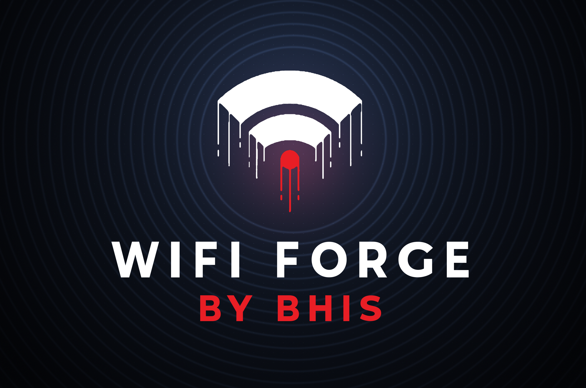
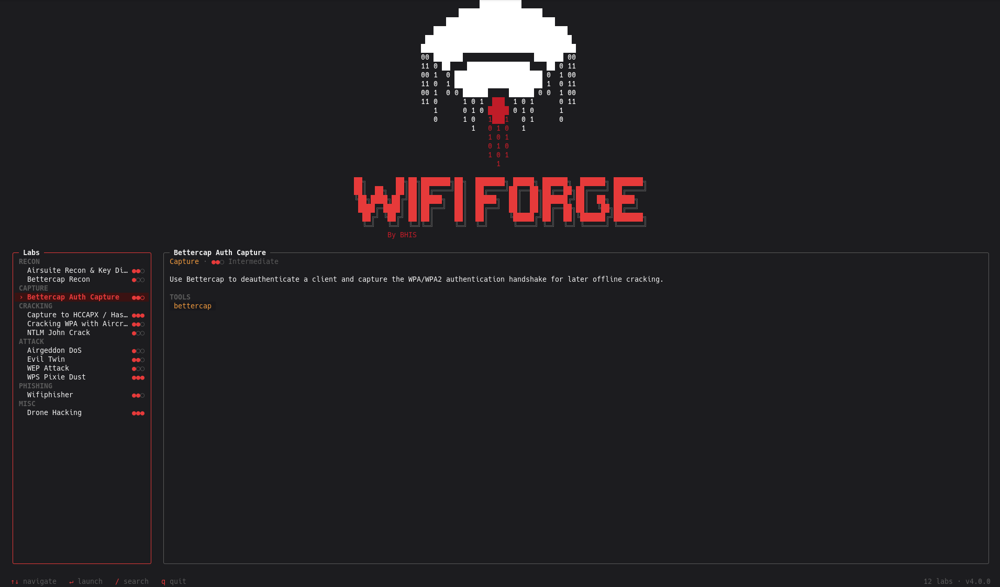

<a name="top"></a>
<div align="center">

<a href="https://github.com/blackhillsinfosec/WifiForge">
  
</a>

### A complete WiFi hacking sandbox - virtual, sandboxed, no radio required.

<samp>mininet-wifi virtual networks in software · spin up a wireless-attack lab from one menu</samp>

<br>
<br>

<a href="https://github.com/blackhillsinfosec/WifiForge/actions"></a>


<a href="https://discord.com/invite/bhis"></a>

<br>
<br>

<a href="#overview"><b>Overview</b></a> &nbsp;·&nbsp;
<a href="https://wififorge.github.io/Installation"><b>Installation</b></a> &nbsp;·&nbsp;
<a href="#usage"><b>Usage</b></a> &nbsp;·&nbsp;
<a href="#writing-labs"><b>Writing Labs</b></a> &nbsp;·&nbsp;
<a href="https://wififorge.github.io/"><b>Labs | Walkthroughs</b></a> &nbsp;·&nbsp;
<a href="#safety"><b>Safety</b></a>

</div>

---

## Overview

**WifiForge** is a terminal-driven framework for building **fully virtual** WiFi networks for security research and training. It's a safe, legal, sandboxed place to practice real wireless attacks, recon, handshake capture, cracking, evil twins, WPS, and more, without any hardware.

The radios are [mininet-wifi](https://github.com/intrig-unicamp/mininet-wifi) virtual interfaces (`mac80211_hwsim`), so an entire airspace, access points, client stations, and your attacker runs in software with nothing sent over the air. Pick a lab from the menu, and WifiForge builds the network, drops you into a per-node terminal, and lets you run the attack hands-on. When you leave, it tears everything down and cleans up.

> [!NOTE]
> WifiForge creates only virtual networks confined to your machine. Use it only in environments you own or are explicitly authorized to test.

<br>

<div align="center">
  
</div>

---
## Walkthroughs

Full walkthrough instructions are in the docs:

### ➜ [wififorge.github.io/](https://wififorge.github.io/)

---

## Usage

Launch the menu and pick a lab:

```bash
sudo wififorge
```

| Key | Action |
| :-- | :-- |
| <kbd>↑</kbd> <kbd>↓</kbd> / <kbd>j</kbd> <kbd>k</kbd> | Move selection |
| <kbd>Enter</kbd> | Launch the selected lab |
| <kbd>/</kbd> | Search (<kbd>Esc</kbd> clears) |
| <kbd>q</kbd> / <kbd>Esc</kbd> | Quit |

Launching a lab needs root. You can browse without it, `wififorge --list` prints every lab, and `wififorge --allow-non-root` opens the menu for a look around.

<div align="right"><a href="#top"><sub>▲ back to top</sub></a></div>

---

## Writing Labs

A lab is a small Python module, discovered automatically. Declare its metadata and a `run()` entry point; the shared harness handles the build → tmux → teardown lifecycle.

```python
from wififorge.labs._schema import LabMeta, Category, Difficulty
from wififorge.labs._harness import run_lab

LAB = LabMeta(
    title="My Lab",
    category=Category.ATTACK,
    difficulty=Difficulty.INTERMEDIATE,
    tools=("aircrack-ng",),
    summary="One or two sentences describing what the learner will do.",
)

def _topology(net):
    net.addStation("Attacker", wlans=1)
    host1 = net.addStation("host1", passwd="password123", encrypt="wpa2")
    ap1 = net.addAccessPoint("ap1", ssid="MyNet", passwd="password123",
                             encrypt="wpa2", mode="g", channel="1")
    net.configureWifiNodes()
    net.addLink(host1, ap1)
    return [ap1]

def run():
    run_lab("MY_LAB", ["Attacker", "host1"], _topology)
```

Drop the file in `src/wififorge/labs/`, or point WifiForge at your own directory with `--labs-dir DIR`. A lab that fails to import won't crash the menu — it just shows as disabled.

<div align="right"><a href="#top"><sub>▲ back to top</sub></a></div>

---

## Safety

> [!WARNING]
> **WifiForge is for authorized security research and education only.** Use the techniques you learn here only on networks, devices, and clients you own or are explicitly authorized to test.

> [!NOTE]
> **WifiForge does not transmit RF.** The entire radio path is mininet-wifi's `mac80211_hwsim` virtual interfaces running on your machine, so nothing is sent over the air.

---

<div align="center">

[**WifiForge**](https://github.com/blackhillsinfosec/WifiForge) &nbsp;·&nbsp;
[**Docs**](https://wififorge.github.io/) &nbsp;·&nbsp;
[**mininet-wifi**](https://github.com/intrig-unicamp/mininet-wifi) &nbsp;·&nbsp;
[**Black Hills InfoSec**](https://www.blackhillsinfosec.com/)

<br>

<sub>Made with ❤️ by <b>Black Hills Information Security</b> · Licensed under Apache 2.0</sub>

<br>

<a href="#top"><sub>▲ back to top</sub></a>

</div>
